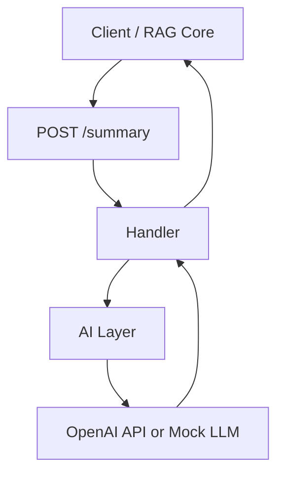

# 📝 AI Summary Service

A lightweight, production-ready Go microservice that generates LLM-powered summaries, explanations, and text transformations using either OpenAI or a deterministic mock LLM for local/offline development.

This service is part of a 4-service AI Backend ecosystem that powers a full RAG (Retrieval-Augmented Generation) system.

---

## ✨ Features

- `POST /summary` → Generate a summary or explanation from input text  
- Real OpenAI support (gpt-4o-mini recommended)  
- Deterministic mock mode for local development  
- Clean Fiber HTTP API  
- Structured logging (Zerolog)  
- Metrics endpoint for observability  
- Lightweight, fast, and deployable on Fly.io  
- Fully containerized (Docker)

---

## 🧠 Architecture Overview



---

## 📦 Project Structure

```
ai-summary-service/
├── main.go
├── go.mod
├── Dockerfile
├── .env.example
└── internal/
    ├── ai/
    │   └── llm.go
    ├── handlers/
    │   └── summary_handler.go
    └── middleware/
        ├── logger.go
        └── metrics.go
```

---

## 🚀 Getting Started

### 1. Clone the repository

```bash
git clone https://github.com/ai-backend-course/ai-summary-service
cd ai-summary-service
```

### 2. Create your `.env` file

```bash
cp .env.example .env
```

### 3. Run locally

```bash
go run .
```

The service will start at:

```
http://localhost:8080
```

---

## 🔧 Example Request

### Endpoint  
```
POST /summary
```

### Request Body

```json
{
  "text": "Golang is a fast, typed, compiled language designed for scalable backend systems."
}
```

### Example Response (Real LLM)

```json
{
  "summary": "Go is a fast, compiled language built for scalable backend systems."
}
```

### Example Response (Mock LLM)

```json
{
  "summary": "MOCK SUMMARY: Golang is a fast, typed..."
}
```

---

## ⚙ Environment Variables

**.env.example:**

```env
OPENAI_API_KEY=your_api_key_here
USE_LLM_MOCK=true
OPENAI_MODEL=gpt-4o-mini
PORT=8080
ENV=development
```

---

## 📊 Metrics

```
GET /metrics
```

Example:

```json
{
  "total_requests": 14,
  "total_errors": 0,
  "avg_latency_ms": 1.4
}
```

---

## 🐳 Docker

### Build & run

```bash
docker build -t ai-summary-service .
docker run -p 8080:8080 ai-summary-service
```

---

## ☁️ Deploy to Fly.io

```bash
flyctl launch
flyctl secrets set OPENAI_API_KEY="your_key"
flyctl secrets set USE_LLM_MOCK=false
flyctl deploy
```

---

## 📜 License

MIT License.
